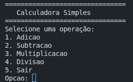
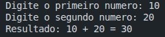
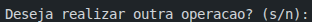
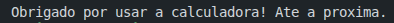

# Calculadora baseada em texto em C

Ao executar o programa, ele exibirá as seguintes opções:

Se o usuário escolher uma operação(por exemplo, "1" para adição), o programa solicitará dois números:

Após exibir o resultado, o programa perguntará se o usuário deseja realizar outra operação:

Se o usuário digitar "s", o programa volta ao menu inicial. Caso contrário, ele exibirá uma mensagem de despedida e encerra:

